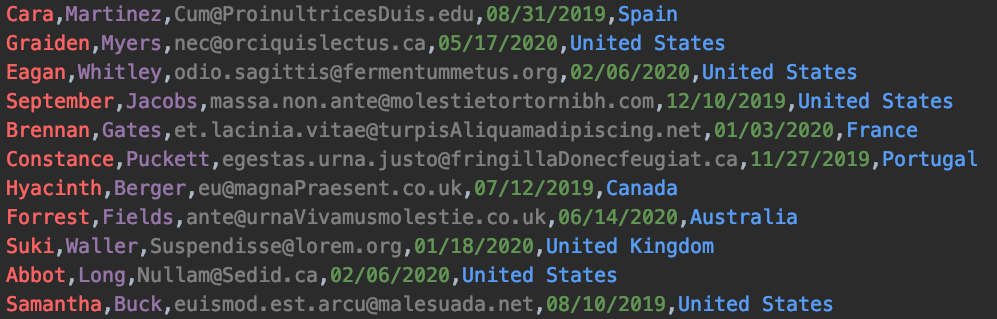

# Changing the number of partitions of a topic

**The question this answers:** "Can I just add partitions to a topic?"

You can, but a keyed record goes to `hash(key) % partitions`, so changing the partition count
silently sends existing keys to different partitions. New records for a key no longer follow the
old ones, and per-key ordering is gone. The safe way is to copy the data into a **new** topic with
more partitions, then move consumers and producers over to it.

This demo does that copy with ksqlDB while a consumer group watches.

## The data

[`producer/data/inputData.csv`](producer/data/inputData.csv): 100 fake rows of
`FirstName,LastName,Email,RegistrationDate,Country`, produced in a loop. The key is **Country**; the
value is the whole row as a String.



## Steps

Commands run from the repo root. Add `-Pconfig=config/ccloud.properties` to every `./gradlew`
command to use Confluent Cloud instead of the local cluster.

**1. Create `five-partitions-topic` with 5 partitions**

```bash
docker compose exec kafka kafka-topics --bootstrap-server kafka:29092 --create --topic five-partitions-topic --partitions 5
# Confluent Cloud: confluent kafka topic create five-partitions-topic --partitions 5
```

**2. Start the producer** (terminal 1)

```bash
./gradlew :change-number-partitions-ksqldb:producer:run
```

**3. Start a consumer group of 5** (terminal 2). Each consumer gets one partition; note that a given
country always arrives at the same consumer.

```bash
NUM_CONSUMERS=5 ./gradlew :change-number-partitions-ksqldb:consumer-group:run
```

```
Consumer-4: {partition=4, offset=0, key=Germany, value=Lev,Dennis,non@tellusfaucibus.com,04/06/2020,Germany}
Consumer-4: {partition=4, offset=1, key=Japan, value=Giacomo,Dalton,amet.diam@nonda.org,02/07/2020,Japan}
```

**4. Migrate to a 10-partition topic with ksqlDB.** Run [`migration.sql`](migration.sql): locally with
the command below, or paste it into the ksqlDB editor in Confluent Cloud (set `auto.offset.reset` to
`Earliest` in the query properties there).

```bash
docker compose exec ksqldb-cli ksql http://ksqldb:8088 -f /demos/change-number-partitions-ksqldb/migration.sql
```

Point out the `country VARCHAR KEY` column. Without a key column ksqlDB writes records with no key,
and the new topic would scatter each country over every partition, which is exactly what we are
trying to avoid.

**5. Cut over.** Stop the producer (Ctrl+C). Check the consumer lag of both `consumer-group-demo`
and the ksqlDB query's consumer group is 0, meaning everything was consumed and migrated:

```bash
docker compose exec kafka kafka-consumer-groups --bootstrap-server kafka:29092 --describe --all-groups
# Confluent Cloud: the Consumers tab of the cluster
```

**6. Restart the consumer group with 10 consumers on the new topic**, reading only new data:

```bash
NUM_CONSUMERS=10 TOPIC=ten-partitions-topic AUTO_OFFSET_RESET=latest ./gradlew :change-number-partitions-ksqldb:consumer-group:run
```

**7. Restart the producer on the new topic:**

```bash
TOPIC=ten-partitions-topic ./gradlew :change-number-partitions-ksqldb:producer:run
```

All ten consumers now get data, and each country still lands on exactly one of them. Once the
migration is done, the ksqlDB query is no longer needed; drop it or delete the ksqlDB cluster.

## Clean up

Stop the clients with Ctrl+C. Delete `five-partitions-topic`, `ten-partitions-topic` and the
`*ksql_processing_log` topic, and the ksqlDB cluster on Confluent Cloud.
